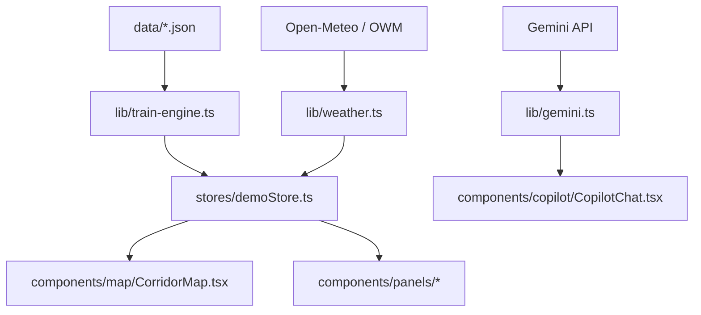

# RailTwin AI — Operational Notes & Known Limitations

This document serves as a guide for the team during judge inspections and live demos. It outlines the architecture, integrations, external limits, and fallback designs.

---

## 1. System Architecture & Data Flow

- **Core Loop**: Every 3 seconds, train positions are computed along their routes using IST schedule mapping, creating a continuous, live operational simulation.
- **Weather Sync**: Every 3 minutes, the weather service fetches current weather data for all 36 stations on the map.
- **ML & Predictions**: When weather updates settle, the prediction engine recalculates delay likelihoods based on historical records, congestion, route length, and weather severity.

---

## 2. API Integrations & Known Limits

### A. Gemini AI Chat (Copilot)
- **Primary Model**: `gemini-flash-latest` (overridable via `GEMINI_MODEL` environment variable).
- **Quota Limit**: Free tier limits apply (15 RPM).
- **Graceful Fallback**: 
  - If the primary model fails or is deprecated, the SDK fallback automatically routes to `gemini-2.5-flash`.
  - If the daily API quota is fully exhausted, the server returns a `429` status code, and the chat UI displays a clean message: *"The AI service has hit its rate limit. Please wait a moment and try again."* instead of failing or rendering blank.

### B. Live Weather (OpenWeather & Open-Meteo)
- **API Endpoint**: Open-Meteo (free/no-key) is used as the primary source, with OpenWeatherMap as a secondary backup (requires `OPENWEATHER_API_KEY` in environment).
- **Server Caching**: Weather data is cached in-memory on the server for **15 minutes** per station to prevent hitting rate limits and to ensure fast load times.
- **Robust Fallback**: If both API servers are offline or rate-limited, the system generates fallback weather based on the current month, hour, and geography (e.g., coastal monsoon rain, northern winter fog, summer heat). The UI displays `Weather unavailable` and `unavailable` instead of crashing.

### C. MapLibre GL Tile Sources
- **Tile Providers**: Uses CartoDB Voyager and Dark Matter styles.
- **Automatic Fallback**: If CartoDB's CDN experiences issues or returns 404, the map initialization script automatically switches map styles and falls back to MapLibre's default vector tile layer.

---

## 3. Key Demo Speaking Points for Judges

1. **Predictive Analytics**: Explain that the delay predictions are computed in real-time by combining historical averages (Kaggle Indian Railways dataset) with dynamic factors (live rainfall rate, visibility, station platforms, and crowd congestion).
2. **What-If Planner**: Demonstrate running a *Signal Failure* or *Track Damage* scenario. It simulates cascading delays and passenger impacts, and the AI Copilot immediately suggests prioritized mitigation actions (e.g., rerouting or platform reassignment).
3. **Resiliency**: The app is built with zero single-points-of-failure. Even without any API keys or network connection, the simulator, map, predictions, and local fallback weather continue to function perfectly.
