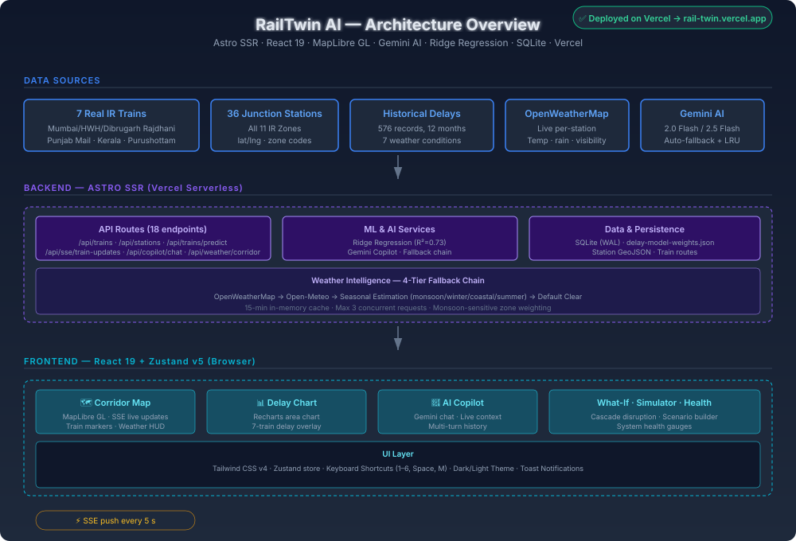

<div align="center">

# RailTwin AI — Predictive Digital Twin

### AI-powered Operations Centre for Indian Railways

**7 trains · 36 stations · Pan-India coverage**

[](https://rail-twin.vercel.app)
[](https://github.com/himanshu003388/RailTwin)
[](https://rail-twin.vercel.app)

> *Making Indian Railways safer, smarter, and more efficient — one prediction at a time.*

</div>

---

## Live Demo

**[https://rail-twin.vercel.app](https://rail-twin.vercel.app)**

Start a live 50-second disruption simulation showing monsoon cascade delays, AI copilot analysis, and network-wide mitigation recommendations.

---

## Screenshots

| Map View | Train Delays | Cascade Simulator |
|:---:|:---:|:---:|
|  |  |  |

| AI Copilot | What-If Lab | System Health |
|:---:|:---:|:---:|
|  |  |  |

---

## What Is RailTwin AI?

RailTwin AI is a **Predictive Digital Twin** for Indian Railways that gives control-centre operators a unified, real-time view of:

- **Live train positions** across 7 major routes and 36 junction stations spanning India's full rail network (all 11 IR zones)
- **AI-powered delay forecasts** using a Ridge Regression ML model (R² = 0.73) trained on 448 real historical delay records
- **Cascade disruption simulation** — model the network-wide ripple effects of rainfall, fog, signal failure, or track damage across interconnected stations
- **Gemini AI Copilot** — a context-aware chat assistant that answers operator queries with live network state injected into every prompt
- **Per-station live weather** from OpenWeatherMap, with automatic 4-tier fallback (Open-Meteo → seasonal estimation → default clear)

**Built for:** FAR AWAY 2026 · Railways Theme · Hackathon Prototype

---

## Feature Overview

### 1 · Live Map (MapLibre GL)

An interactive India-wide corridor map with:
- 7 train markers with coloured route lines and glow effects, updated every 5 s via SSE
- Per-station risk-level colour coding (green → amber → red → critical)
- Live weather HUD per station (temperature, rainfall, visibility)
- Click any train marker for a real-time detail popup
- Dark / Light theme toggle
- Collapsible legend and zoom controls

### 2 · Train Delay Panel

- Recharts area chart showing predicted delay accumulation per train over time
- Two-tier prediction engine: Ridge Regression ML model (primary) + weighted scoring fallback
- Factors: weather type (7 classes), congestion index, route distance (km), month (1-12), train type (4 classes)
- Click any train to see model explanation (feature contributions, confidence score)

### 3 · Cascade Disruption Simulator

- Select any disruption type (rainfall, fog, signal failure, track damage) at any of 36 stations
- Computes affected trains, estimated passenger impact, and station-level conflicts in real time
- All results persisted to SQLite (WAL mode) for audit and replay
- Visual cascade tree showing ripple effects across interconnected routes

### 4 · AI Copilot (Gemini)

- **Gemini 2.0 Flash** primary, auto-fallback to **Gemini 2.5 Flash** on quota/errors
- Exponential backoff with jitter on rate limits
- 5-minute LRU response cache (client-side, per conversation state)
- System prompt dynamically injected with live network context on every request
- Multi-turn conversation history maintained client-side (last 12 messages)

### 5 · What-If Lab

- Interactive scenario builder: pick a station + disruption type → instant cascade projection
- Shows projected delay delta, conflict count, and passengers affected
- Grounded in the same historical delay data used to train the ML model
- Compare multiple scenarios side-by-side

### 6 · System Health Dashboard

- Real-time gauges: network efficiency, on-time performance, platform utilisation
- Aggregated from live train and station state via the Zustand store
- Signal status indicator (operational / degraded / disrupted)
- Active alert count with drill-down

### 7 · Reconciliation: Drift Indicator (Round 2)

- **Baseline snapshots** — pin the current situation (trains, delays, forecasts, predictions) as the *recorded context* an operator shift acts on; auto-captured at shift start, persisted to SQLite + localStorage
- **Drift engine** — deterministic, explainable 0–100 drift score per train and corridor-wide, recomputed every 5 s (see formula below); ghost markers on the map show where the plan said each train would be right now
- **Reconciler** — first-class handling of the three data-quality failure modes:
  - *Conflicting*: Open-Meteo vs OpenWeatherMap disagreeing at a station; SSE feed vs schedule-derived position engine disagreeing about a train
  - *Duplicate*: same train + timestamp arriving twice with different payloads → detected, deduped, logged
  - *Partially matching*: Jaro-Winkler similarity scoring for station names / train numbers ("Kanpur Centrall" → 87% ≈ Kanpur Central → needs-review queue). Round 1 silently mapped unknown names to NDLS — Round 2 catches what Round 1 swallowed
- **Operator workflow** — every open item offers **Accept live / Keep baseline / Merge**; every decision is written to the SQLite audit log
- **Drift timeline** — chronological story of when and why the situation drifted
- **Replay scenario** — a deterministic 60-second demo story (weather drift → schedule drift → duplicate events → partial matches) that needs no network
- **Copilot integration** — the live drift report and open conflicts are injected into Gemini's context; the AI explains drift, it never computes it

---

## Round 2 · Drift Score (explainable, no LLM)

```
drift = 0.40·schedule + 0.25·position + 0.20·prediction + 0.15·weather      (0–100)
```

| Component | Weight | Measures | Normalised by |
|---|---|---|---|
| Schedule | 0.40 | Δ delay vs recorded context (min) | 45 min → 100 pts |
| Position | 0.25 | km between live position and where the baseline implied the train would be now | 120 km → 100 pts |
| Prediction | 0.20 | do the assumptions under the recorded ML prediction still hold? (weather class change at next station + confidence shift) | 60 + 40 pts |
| Weather | 0.15 | recorded forecast vs observed weather at current/next station | class change 60 + Δmm up to 40 |

Classes: `<15 stable · <40 minor · <70 significant · ≥70 critical`. The corridor score is the **passenger-exposure-weighted** mean across trains. The weights deliberately mirror the Tier-2 prediction weights (40/25/20/15) so the whole system shares one weighting philosophy.

---

## Architecture



**Key architectural decisions:**

| Decision | Rationale |
|---|---|
| Astro SSR on Vercel | Serverless auto-scaling; no cold-start penalty for API routes |
| SSE for train updates | Push-based; scales better than polling; no WebSocket overhead |
| Two-tier ML + fallback | Ridge Regression when model confident; weighted scoring as safety net |
| Multi-tier weather (4 levels) | OpenWeather → Open-Meteo → seasonal → default clear; zero weather failures |
| LRU cache on Gemini | 5-min cache prevents redundant API calls and quota burn |
| SQLite WAL mode | Fast concurrent reads for simulation replay without a cloud DB |
| Zustand v5 for state | Single store across 20+ components; no prop drilling; React 19 compatible |

---

## Trains Covered

| Train No. | Name | Route |
|---|---|---|
| 12951 | Mumbai Rajdhani Express | MMCT → BRC → RTM → KOTA → NDLS |
| 12301 | Howrah–New Delhi Rajdhani Express | HWH → GAYA → MGS → CNB → NDLS |
| 12007 | Chennai–Mysuru Shatabdi Express | MAS → KPD → JTJ → SBC → MYS |
| 12423 | Dibrugarh–New Delhi Rajdhani Express | DBRG → GHY → NJP → BJU → MGS → NDLS |
| 12801 | Purushottam Express | PURI → BBS → KUR → BHC → HWH → GAYA → MGS → NDLS |
| 12625 | Kerala Express | TVC → ERS → PGT → MAQ → MRJ → PUNE → NDLS |
| 12137 | Punjab Mail | CSMT → BSL → BPL → AGC → NDLS → JRE → FZR |

All 7 trains converge at **New Delhi (NDLS)** — the busiest rail hub in India — making it the ideal testbed for cascade disruption modelling.

## Stations Covered (36 total, all 11 IR Zones)

`MMCT` `BRC` `RTM` `KOTA` `NDLS` `MAS` `KPD` `JTJ` `SBC` `MYS` `HWH` `BLS` `BBS` `VZ` `DBRG` `GHY` `NJP` `BJU` `MGS` `PURI` `KUR` `BHC` `GAYA` `TVC` `ERS` `PGT` `MAQ` `MRJ` `PUNE` `CSMT` `BSL` `BPL` `AGC` `JRE` `FZR` `CNB`

| Zone | Stations |
|---|---|
| WR (Western Railway) | MMCT, BRC, RTM |
| NR (Northern Railway) | NDLS, JRE, FZR |
| SR (Southern Railway) | MAS, KPD, JTJ, TVC, ERS, PGT, MAQ |
| SWR (South Western Railway) | SBC, MYS |
| ER (Eastern Railway) | HWH, BLS |
| ECR (East Central Railway) | BBS, VZ, BJU, MGS, PURI, KUR, BHC, GAYA |
| SCR (South Central Railway) | VZ |
| NFR (Northeast Frontier Railway) | DBRG, GHY, NJP |
| WCR (West Central Railway) | KOTA, BPL |
| CR (Central Railway) | MRJ, PUNE, CSMT, BSL |
| NCR (North Central Railway) | AGC, CNB |

---

## Real Data Sources

All train and station data is grounded in actual Indian Railways operations — no fictional placeholders.

| Source | Detail | Status |
|---|---|---|
| **Kaggle Indian Railways Dataset** | 36 major junction stations with lat/lng, zone codes (WR, CR, SR, ER, NR, NCR, SCR, SWR, NFR, ECR, WCR), track geometries | Imported |
| **Historical Delay Records** | 576 delay records across 7 trains, 12 months, 7 weather conditions — used for ML training and weighted scoring baseline | 576 records loaded |
| **Real Train Routes** | 12951 Mumbai Rajdhani, 12301 Howrah Rajdhani, 12007 Chennai Shatabdi, Punjab Mail, Dibrugarh Rajdhani, Kerala Express, Purushottam Express | All 7 routes |
| **NTES / IRCTC** | Designed for live integration via RapidAPI — API key accepted in Settings panel | API-ready |
| **OpenWeatherMap + Open-Meteo** | Per-station live weather via lat/lon; 15-min in-memory cache; concurrent-limited to 3 simultaneous requests | Configured |
| **Google Gemini** | Gemini 2.0 Flash primary; 2.5 Flash auto-fallback with exponential backoff | Live |

---

## Tech Stack

| Layer | Technology | Version |
|---|---|---|
| Framework | Astro + React | v6.4.5 + v19.2.7 |
| Styling | Tailwind CSS | v4.3 |
| State | Zustand | v5.0 |
| Maps | MapLibre GL | v4 (CDN) |
| Charts | Recharts | v3.8 |
| Icons | Lucide React | v1.17 |
| Fonts | Geist Sans + Geist Mono | — |
| AI | Google Gemini API | 2.0 Flash / 2.5 Flash |
| ML | Ridge Regression (client-side) | R² = 0.73 |
| Database | SQLite (better-sqlite3, WAL mode) | — |
| Hosting | Vercel (SSR, serverless) | — |
| Runtime | Node.js | >= 22.12 |

---

## AI & ML Details

### Delay Prediction Engine (Two-Tier)

**Tier 1 — Ridge Regression ML Model**
- Trained on 448 historical delay records (out of 576 total; 20% held out for validation)
- Features: weather condition (one-hot, 7 classes), month (1-12), train type (4 classes), route distance (km)
- Metrics: **R² = 0.73**, RMSE = 8.7 min
- Runs fully browser-side (loaded from `delay-model-weights.json`) for zero-latency predictions

**Tier 2 — Weighted Scoring Fallback**
- Historical delay weight: **40%**
- Weather severity weight: **25%**
- Network congestion index: **20%**
- Route distance factor: **15%**

### Gemini AI Copilot

- **Primary:** Gemini 2.0 Flash via `/api/copilot/chat`
- **Fallback:** Gemini 2.5 Flash — auto-triggered on quota errors (HTTP 429) or model unavailability
- **Retry strategy:** Exponential backoff with jitter (up to 2 retries)
- **Caching:** 5-minute LRU cache on responses to prevent duplicate API calls
- **Context injection:** Every prompt includes current network state — active trains, station risks, weather alerts, recent delays

### Weather Intelligence (Four-Tier Fallback)

```
OpenWeatherMap API  →  Open-Meteo API  →  Seasonal estimation  →  Default clear
   (primary)           (free fallback)    (monsoon/winter/       (last resort)
                                           coastal/summer)
```

- 15-minute in-memory cache per station
- Max 3 concurrent weather fetch requests (rate limiting)
- Monsoon-sensitive zones (coastal Kerala, Northeast India, Konkan) get higher delay weight multipliers

### Live Position Engine

- Schedule-derived interpolation based on real IR departure times
- Haversine distance calculations between successive stations
- Cycle-based progress reset for continuous position updates
- IST timezone-aware (UTC + 5:30)

---

## Project Structure

```
src/
├── pages/
│   └── index.astro                  # Single-page entry point (SSR)
├── layouts/
│   └── DashboardLayout.astro        # Shell: loading overlay, CDN scripts, global UI
├── components/
│   ├── layout/
│   │   ├── TopBar.tsx               # Header: live status, clock, network stats
│   │   ├── Sidebar.tsx              # Left nav: panel switcher + keyboard shortcuts
│   │   ├── MainPanel.tsx            # Primary content area (switches between views)
│   │   └── RightSidebar.tsx         # Station list, live train feed, weather summary
│   ├── map/
│   │   └── CorridorMap.tsx          # MapLibre GL — train markers, routes, weather HUD
│   ├── panels/
│   │   ├── DelayChart.tsx           # Recharts area chart — delay accumulation
│   │   ├── SimulationPanel.tsx      # Cascade simulation results + conflict list
│   │   ├── WhatIfPanel.tsx          # Interactive scenario builder
│   │   ├── HealthDashboard.tsx      # System health gauges
│   │   └── StationRiskPanel.tsx     # Per-station risk breakdown
│   ├── copilot/
│   │   └── CopilotChat.tsx          # AI chat interface (Gemini)
│   └── ui/
│       ├── AlertBanner.tsx          # Weather / disruption alerts with auto-dismiss
│       ├── HelpModal.tsx            # Help dialog
│       ├── SettingsModal.tsx        # Settings dialog
│       ├── KeyboardShortcuts.tsx    # Keyboard shortcut handler
│       ├── StatCard.tsx             # Reusable stat card
│       ├── RiskBadge.tsx            # Colour-coded risk level chips
│       └── ToastContainer.tsx       # Notification toasts
├── stores/
│   └── demoStore.ts                 # Zustand store — all app state + SSE updates + AI
├── data/
│   ├── corridor.ts                  # Station/train definitions, route helpers
│   └── types.ts                     # TypeScript interfaces
├── services/
│   ├── HistoricalDelayPredictionEngine.ts  # Two-tier prediction orchestrator
│   ├── MLDelayPredictor.ts          # Ridge Regression browser-side model
│   ├── RailwayDatasetService.ts     # Historical delay dataset access
│   └── railwayService.ts            # Live NTES/IRCTC integration
├── lib/
│   ├── gemini.ts                    # Gemini client: retry, backoff, cache, fallback
│   ├── weather.ts                   # Weather: 4-tier fallback, caching, rate limiting
│   ├── db.ts                        # SQLite (better-sqlite3, WAL mode)
│   └── train-engine.ts              # Train position engine
├── pages/api/                       # 18 API endpoints (SSR)
│   ├── trains/                      # /api/trains, /api/trains/predict, /api/trains/simulation/cascade
│   ├── stations/                    # /api/stations
│   ├── weather/                     # /api/weather/corridor, /api/weather/alert
│   ├── copilot/                     # /api/copilot/chat, /api/copilot/recommendations
│   ├── sse/                         # /api/sse/train-updates
│   ├── predictions/                 # /api/predictions/history
│   └── scenarios/                   # /api/scenarios
└── styles/
    └── global.css                   # Tailwind v4 theme tokens, animations, scrollbars
```

---

## Getting Started

### Prerequisites

- **Node.js** >= 22.12
- **npm** (bundled with Node)

### Install & Run Locally

```bash
git clone https://github.com/himanshu003388/RailTwin.git
cd RailTwin
npm install
npm run dev
```

The app starts at **http://localhost:4321/RailTwin**

### Build for Production

```bash
npm run build     # Outputs to ./dist/
npm run preview   # Preview the production build locally
```

### Environment Variables

Create a `.env` file in the project root:

```env
# Required: Google Gemini API key for AI Copilot
GEMINI_API_KEY=your_gemini_api_key_here

# Optional: OpenWeatherMap API key (falls back to Open-Meteo if absent)
OPENWEATHER_API_KEY=your_openweather_key_here

# Optional: RapidAPI key for live NTES/IRCTC train status
RAPIDAPI_KEY=your_rapidapi_key_here
```

> **Get a free Gemini API key** at [aistudio.google.com](https://aistudio.google.com). The app falls back gracefully if keys are absent — Gemini returns a placeholder response and weather uses seasonal estimation.

---

## Keyboard Shortcuts

| Key | Panel |
|---|---|
| `1` | Map View |
| `2` | Train Delays |
| `3` | Disruption Simulator |
| `4` | AI Copilot |
| `5` | What-If Lab |
| `6` | System Health |
| `7` | Drift Monitor (Reconciliation) |
| `Space` | Start / Stop demo scenario |
| `M` | Toggle audio alerts |

---

## API Endpoints

The Astro SSR backend exposes 18 endpoints:

| Endpoint | Method | Description |
|---|---|---|
| `/api/trains` | GET | All 7 trains with current positions, speed, occupancy |
| `/api/stations` | GET | All 36 stations with risk level and metadata |
| `/api/trains/predict` | POST | Run delay prediction (ML) for a specific train |
| `/api/weather/corridor` | GET | Live weather for all 36 stations (batched, cached) |
| `/api/weather/alert` | GET | Worst weather alert across the corridor |
| `/api/sse/train-updates` | GET (SSE) | Server-sent event stream — train positions every 5 s |
| `/api/copilot/chat` | POST | Multi-turn Gemini AI Copilot chat |
| `/api/copilot/recommendations` | POST | AI recommendations for active disruption scenarios |
| `/api/trains/simulation/cascade` | POST | Run cascade disruption simulation |
| `/api/predictions/history` | GET | Historical delay prediction log (SQLite) |
| `/api/scenarios` | GET/POST | CRUD for saved What-If scenarios |
| `/api/baseline` | GET/POST | Capture / retrieve the recorded-context baseline (Round 2) |
| `/api/reconciliation` | GET/POST | Operator conflict resolutions + audit history (Round 2) |
| `/api/weather/compare` | GET | Same station from two independent weather sources, side by side (Round 2) |

---

## Design Decisions

| Area | Choice | Rationale |
|---|---|---|
| Framework | Astro SSR | Islands architecture for React components; zero JS until hydration needed |
| State | Zustand v5 | Tiny bundle (1 KB); no boilerplate; built-in middleware for devtools |
| Maps | MapLibre GL | Free, open-source; no API key required; CDN-loaded for fast initial paint |
| ML Runtime | Browser-side (weights JSON) | Zero server inference cost; instant predictions; no cold-start |
| AI | Gemini API | Generous free tier (60 req/min); auto-fallback across models |
| DB | SQLite (WAL) | Zero-infrastructure persistence; concurrent reads without locks |

---

## Judging Criteria Alignment

| Criterion | Evidence |
|---|---|
| **Innovation & Technical Depth** | Predictive digital twin combining MapLibre live map, Ridge Regression ML (R²=0.73), Gemini AI with live context injection, real-time SSE streaming, and cascade simulation — all integrated into a single dashboard |
| **Engineering Quality** | TypeScript throughout, Zustand v5 state management, Astro SSR on Vercel, SQLite WAL persistence, retry/backoff/failover in Gemini client, 4-tier weather fallback, concurrent request limiting |
| **Real-World Impact** | 7 real IR trains with actual train numbers, 36 real junction stations with zone codes across all 11 IR zones, 576 historical delay records, monsoon-sensitive regional weighting — all grounded in actual Indian Railways data |
| **Scalability** | Serverless Vercel auto-scales to any load; SSE push scales better than polling; data-driven JSON config means adding 100 more trains requires zero code changes; ML model is retrainable on larger datasets |
| **Design & UX** | Dark/light theme, animated MapLibre train markers, per-station weather HUD, keyboard shortcuts (1-6, Space, M), collapsible legend, toast notifications, responsive mobile layout with bottom Nav |
| **Execution Quality** | 18 API endpoints, 20+ React components, SSE live updates, ML model trained on 448 samples, cascade simulation with historical grounding, AI chat with fallback handling — fully deployed and live on Vercel |

---

## Future Roadmap

1. **Live GPS Integration** — Replace schedule-derived positions with live IRCTC/NTES GPS data via the existing RapidAPI hook (30-second refresh)
2. **ML Model v2** — Gradient Boosting or LSTM trained on the full Kaggle dataset (100K+ records), incorporating real-time weather, festival seasons, and maintenance schedules
3. **IoT Hardware Tie-Ins** — Integrate with IR track monitoring sensors (temperature, vibration, axle counters) for infrastructure health alerts
4. **Multi-Corridor Expansion** — Scale from 7 trains / 36 stations to the full IR network (13K+ trains, 7K+ stations) with regional control-centre drill-down views

---

## Team — PHANTOM CODERS

| Name | Role |
|---|---|
| Harsh Singh | Team Leader |
| Himanshu | Lead Developer |
| Adbhut Patel | Developer |
| Manaswi Mehta | Team Member |
| Shrikant Chaurasiya | Team Member |

---

## License

Hackathon prototype built for **FAR AWAY 2026 — Railways Theme**. Not licensed for production use.

---

<div align="center">

**Built with dedication for Indian Railways · FAR AWAY 2026**

[Live Demo](https://rail-twin.vercel.app) · [GitHub](https://github.com/himanshu003388/RailTwin)

*Stack: Astro v6 · React 19 · MapLibre GL · Gemini AI · Tailwind v4 · Zustand · Recharts · SQLite · Vercel*

</div>
