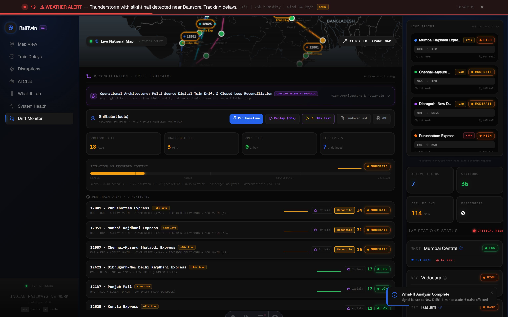

<div align="center">

# 🚆 RailTwin AI — Predictive Digital Twin & Telemetry Reconciliation

### Mission-Critical Operations Control Centre (OCC) for Indian Railways
**7 Major Trunk Routes · 36 Junction Stations · All 11 Indian Railways (IR) Administrative Zones**

[](https://rail-twin.vercel.app)
[](https://rail-twin.vercel.app/?demo=replay)
[](https://rail-twin.vercel.app/?demo=replay&fast=1)
[](https://github.com/himanshu003388/RailTwin)
[](https://github.com/himanshu003388/RailTwin)

<br/>

> **"In high-density railway control operations, the single greatest point of failure isn't the train — it is the widening divergence between the recorded dispatch plan and ground reality."**  
> *RailTwin AI bridges this gap through continuous multi-source telemetry reconciliation, explainable 4-factor drift calculation, real-time spatial digital twin overlays, and closed-loop operator re-anchoring.*

</div>

---

## ⚡ Quick Links & Navigation

- 🌐 **Live Web Application:** [https://rail-twin.vercel.app](https://rail-twin.vercel.app)
- ⏱ **60-Second Deterministic Replay:** [https://rail-twin.vercel.app/?demo=replay](https://rail-twin.vercel.app/?demo=replay)
- ⚡ **18-Second Fast Replay:** [https://rail-twin.vercel.app/?demo=replay&fast=1](https://rail-twin.vercel.app/?demo=replay&fast=1)
- 📋 **Demonstration & Walkthrough Guide:** [`DEMO.md`](file:///c:/Users/himan/Desktop/RailTwin-main/DEMO.md)
- 🎨 **Industrial Design System & Telemetry Tokens:** [`DESIGN.md`](file:///c:/Users/himan/Desktop/RailTwin-main/DESIGN.md)

---

## 🎯 Telemetry Reconciliation & Drift Engine

### The Operational Challenge
> **Reconciliation & Drift Detection**  
> *Railway Operations Control Centres (OCC) constantly ingest imperfect, conflicting, duplicate, or partially matching information. Over a 12-hour shift, ground truth drifts silently away from the recorded timetable context, leading to dispatch blind spots and uncoordinated interventions.*

### How RailTwin Solves It (The Complete Architectural Solution)

RailTwin delivers a production-grade **Telemetry Reconciliation & Drift Engine**:

```
 ┌──────────────────────┐      ┌──────────────────────────────┐      ┌─────────────────────────────┐
 │ 1. Pinned Baseline   │ ───► │ 2. Telemetry Reconciliation  │ ───► │ 3. Explainable Drift Engine │
 │  • Shift snapshot    │      │  • Jaro-Winkler + Route Prior│      │  • 4-Factor (0–100) Score   │
 │  • Timetable context │      │  • Dual-source weather dedup │      │  • Passenger exposure index │
 └──────────────────────┘      └──────────────────────────────┘      └──────────────┬──────────────┘
                                                                                    │
 ┌──────────────────────┐      ┌──────────────────────────────┐                     │
 │ 5. Handover & Audit  │ ◄─── │ 4. Closed-Loop Resolution    │ ◄───────────────────┘
 │  • SQLite WAL log    │      │  • Re-anchor live to plan    │
 │  • 1-Click .md / PDF │      │  • Real-time score collapse  │
 └──────────────────────┘      └──────────────────────────────┘
```

1. **Pinned Operational Baseline:** Capture an exact immutable snapshot of scheduled arrival/departure milestones, train delays, and weather forecasts across all 36 junction stations at shift start.
2. **Automated Triage of Noisy Feeds:**
   - **Conflicting Feeds:** Multi-source weather arbitration between OpenWeatherMap and Open-Meteo with operator override.
   - **Duplicate Packets:** Real-time stream deduplication filtering identical timestamp/train telemetry without corrupting the live twin.
   - **Partial Matching:** **Two-Signal Matcher** combining **Jaro-Winkler string similarity** ($p=0.10, \ell \le 4$) with a **$+0.12$ Spatial Route Plausibility Prior** to resolve noisy OCR inputs (e.g. `"Kanpur Centrall"` $\rightarrow$ `CNB`), eliminating silent fallback errors.
3. **Continuous 4-Factor Drift Formulation:** Real-time $0–100$ scoring measuring schedule deviation ($40\%$), spatial GPS/transponder distance ($25\%$), ML prediction validity ($20\%$), and station weather divergence ($15\%$).
4. **Ghost Marker Spatial Visualization:** Dotted ghost markers ($\large\circ$) on MapLibre GL indicating planned timetable coordinates with dynamic tether lines and Plan vs. Live diff cards.
5. **Closed-Loop Operator Resolution:** Interactive triage actions (*Accept Live*, *Keep Baseline*, *Merge*) that mutate the active twin state immediately, collapsing drift scores back to Stable.
6. **Live Telemetry Ingestion Sandbox:** Interactive playground allowing operators to input arbitrary malformed telemetry strings and watch them flow through the reconciliation pipeline in real time.
7. **Shift Handover Briefings:** 1-click automated generation of Markdown (`.md`) and PDF audit logs summarizing baseline diffs, peak drift, zone signal integrity, and operator actions.

---

## 📸 Operations Control Centre Views

### 🎯 Featured: Telemetry Reconciliation & Drift Engine (`Drift Monitor`)

*Real-time 4-factor drift monitoring, situational vs baseline deviation gauges, automated triage resolution, and shift audit logs.*

<br/>

| 1 · Live Corridor Map & Ghost Markers | 2 · Train Delay Intelligence | 3 · Cascade Simulator |
|:---:|:---:|:---:|
|  |  |  |
| *GPU vector map with live transponders, station risk rings & ghost plan overlays* | *Ridge Regression ML delay forecasts with exact mathematical feature attributions* | *Monsoon & fog disruption ripple propagation across 36 junction hubs* |

| 4 · Gemini AI Copilot | 5 · What-If Scenario Lab | 6 · System Health Dashboard |
|:---:|:---:|:---:|
|  |  |  |
| *Context-injected operator copilot with 1-click triage & mitigation chips* | *Dispatcher sandbox for testing tactical interventions before live execution* | *Corridor OTP, section throughput diagnostics, and junction platform utilization* |

---

## 📐 Mathematical Formulation of Drift Score

The RailTwin Drift Engine computes an explainable, continuous score $D \in [0, 100]$ for each train and aggregates a passenger-weighted corridor score every 5 seconds:

$$\text{Drift Score} = 0.40 \cdot S_{\text{sched}} + 0.25 \cdot S_{\text{pos}} + 0.20 \cdot S_{\text{pred}} + 0.15 \cdot S_{\text{wx}} \quad [0 - 100]$$

$$\text{Corridor Drift} = \frac{\sum_{i=1}^{N} \left( D_i \times P_i \times W_{\text{prio}, i} \right)}{\sum_{i=1}^{N} \left( P_i \times W_{\text{prio}, i} \right)}$$

Where $P_i$ is active passenger capacity and $W_{\text{prio}, i}$ is the train priority coefficient (e.g. Rajdhani $= 1.3$, Express $= 1.0$).

### 4-Factor Component Breakdown

| Component | Weight | Mathematical Input | Operational Justification | Normalization Ceiling |
|---|:---:|---|---|---|
| **Schedule ($S_{\text{sched}}$)** | **40%** | $\Delta\text{Delay} = \|\text{Delay}_{\text{live}} - \text{Delay}_{\text{baseline}}\|$ | Schedule adherence directly governs sectional slotting and junction line clearance. | $45\text{ min} \rightarrow 100\text{ pts}$ |
| **Position ($S_{\text{pos}}$)** | **25%** | $\Delta d = \text{Haversine}(\mathbf{x}_{\text{live}}, \mathbf{x}_{\text{planned}})$ | Physical geographic distance between actual GPS transponder and timetable position. | $120\text{ km} \rightarrow 100\text{ pts}$ |
| **Prediction ($S_{\text{pred}}$)** | **20%** | Feature validity shift + model confidence delta | Measures whether initial ML model environmental assumptions still hold true. | Weather class shift ($60\text{ pts}$) + $\Delta\text{Conf}$ ($40\text{ pts}$) |
| **Weather ($S_{\text{wx}}$)** | **15%** | Meteorological condition shift & precipitation delta | Leading indicator for upcoming track adhesion and visibility degradation. | Severity class shift ($60\text{ pts}$) + $\Delta\text{mm}$ up to $40\text{ pts}$ |

### Operational Severity Classifications

| Score Range | Severity Band | Status | Visual Indicator | OCC Operational Action |
|:---:|:---:|:---:|:---:|---|
| **0 – 24** | `STABLE` | Nominal | 🟢 Green Pill | Normal operations; standard 5s telemetry polling. |
| **25 – 49** | `MINOR` | Advisory | 🟡 Amber Pill | Pre-warning; automated conflict triage initiated. |
| **50 – 69** | `SIGNIFICANT` | Degraded | 🟠 Orange Pill | Sectional controller alerted; ghost markers highlighted on vector map. |
| **70 – 100** | `CRITICAL` | Severe | 🔴 Crimson Pulse | Two-tone audio alarm sounds; automated Gemini AI mitigation seeded; mandatory resolution required. |

### Operational Design Constants

```typescript
export const DRIFT_THRESHOLDS = {
  SCHEDULE_MAX_MINUTES: 45,       // Saturation ceiling for superfast corridor slots
  POSITION_MAX_KM: 120,           // Standard distance between major junction signaling blocks
  SPATIAL_TOLERANCE_KM: 40,       // Permissible GPS/SSE jitter window before conflict flagging
  CRITICAL_DIVERGENCE_KM: 100,    // Anomaly indicating loop-line diversion or transponder desync
  JARO_WINKLER_AUTO_MATCH: 0.90,  // High-confidence threshold (OCR typos resolved automatically)
  JARO_WINKLER_REVIEW_BAND: 0.60, // Ambiguous inputs (0.60–0.90) routed to Triage Inbox
  JARO_WINKLER_REJECT: 0.60,      // Unrecognized garbage inputs rejected (no silent NDLS fallback)
  BASELINE_EXPIRY_HOURS: 12,      // Standard 12-hour controller shift cycle
  POLL_INTERVAL_MS: 5000,         // Telemetry engine tick frequency
};
```

---

## 🔬 Baseline Tracking vs Advanced Reconciliation Capabilities

| Capability | Standard Telemetry Tracking | RailTwin Intelligent Reconciliation & Drift Engine |
|---|---|---|
| **Unknown Station Parsing** | Silently defaulted to arbitrary stations (e.g. `'ndls'`) | **Two-Signal Matcher:** Jaro-Winkler ($p=0.10, \ell \le 4$) + $+0.12$ Spatial Route Plausibility Prior |
| **Live Telemetry Ingestion** | Staged static updates | **Interactive Live Sandbox** allowing operators to input arbitrary noisy text/CSV strings |
| **Data Ingestion Robustness** | Single trusted feed assumed | **Dual-source weather arbitration** (OpenWeatherMap vs Open-Meteo) & duplicate stream dedup |
| **Operational Baseline** | Static timetable | **Immutable Shift Baseline Snapshots** persisted across SQLite WAL and browser storage |
| **Drift Monitoring** | None (unaware of divergence) | **Continuous 4-Factor Mathematical Drift Engine** ($0–100$) with passenger exposure scaling |
| **Spatial Digital Twin** | Live train markers only | **Ghost Markers (◌)** displaying planned timetable position with dynamic dashed tether lines |
| **Operator Actionability** | Passive read-only viewing | **Closed-Loop Resolution:** *Accept Live*, *Keep Baseline*, or *Merge* re-anchors twin in real time |
| **Auditory & Alerting** | Visual banners only | **Web Audio API two-tone critical frequency alarm** ($\ge 70$) and resolution chime (Mute: `M`) |
| **Shift Governance & Audit** | Ephemeral browser state | **SQLite WAL Audit Trail + 1-Click Shift Handover Report** (Markdown `.md` & print-ready PDF) |
| **Deterministic Replay** | No standardized demo | **60-Second Full Replay + ⚡ 18-Second Fast Replay** (`?demo=replay&fast=1`) for testing |
| **Test Verification** | Manual browser checks | **48 / 48 Pure Unit & Store Integration Tests (100% Passed with Vitest)** |

---

## 🏗 System Architecture & Telemetry Pipeline

```
                                  ┌────────────────────────────────────────┐
                                  │      Client Dashboard (Astro SSR)      │
                                  │  React 19 · Zustand v5 · Tailwind v4   │
                                  └───────────────────┬────────────────────┘
                                                      │
                    ┌─────────────────────────────────┼────────────────────────────────┐
                    │                                 │                                │
                    ▼                                 ▼                                ▼
       ┌────────────────────────┐        ┌────────────────────────┐       ┌────────────────────────┐
       │   MapLibre GL Map      │        │  Analytical Panels     │       │  AI Copilot & Triage   │
       │  • Live SSE Telemetry  │        │  • Recharts ML Delays  │       │  • Gemini 2.0/2.5 Flash│
       │  • Ghost Markers (◌)   │        │  • Disruption Cascade  │       │  • Jaro-Winkler Inbox  │
       │  • Plan vs Live Diff   │        │  • System Health Gauges│       │  • Shift Handover .md  │
       └────────────────────────┘        └────────────────────────┘       └────────────────────────┘
                    ▲                                 ▲                                ▲
                    │                                 │                                │
                    └─────────────────────────────────┼────────────────────────────────┘
                                                      │
                                                      ▼
                                  ┌────────────────────────────────────────┐
                                  │     Unified Zustand State Store        │
                                  │  (demoStore.ts & driftStore.ts)        │
                                  └───────────────────┬────────────────────┘
                                                      │
                    ┌─────────────────────────────────┼────────────────────────────────┐
                    │                                 │                                │
                    ▼                                 ▼                                ▼
       ┌────────────────────────┐        ┌────────────────────────┐       ┌────────────────────────┐
       │  Drift Engine (Pure)   │        │  Reconciler (Pure)     │       │  ML Delay Predictor    │
       │  • 4-Factor Weighted   │        │  • Jaro-Winkler Match  │       │  • Ridge Regression    │
       │  • Passenger Exposure  │        │  • Stream Deduplication│       │  • 448 Historical Rows │
       │  • Baseline Snapshots  │        │  • Conflict Arbitrator │       │  • Browser JSON Weights│
       └────────────────────────┘        └────────────────────────┘       └────────────────────────┘
                    ▲                                 ▲                                ▲
                    │                                 │                                │
                    └─────────────────────────────────┼────────────────────────────────┘
                                                      │
                                                      ▼
                                  ┌────────────────────────────────────────┐
                                  │    Astro SSR & API Route Layer         │
                                  │  (18 Endpoints · SQLite WAL Storage)   │
                                  └───────────────────┬────────────────────┘
                                                      │
                    ┌─────────────────────────────────┼────────────────────────────────┐
                    │                                 │                                │
                    ▼                                 ▼                                ▼
       ┌────────────────────────┐        ┌────────────────────────┐       ┌────────────────────────┐
       │  SSE Telemetry Stream  │        │  Multi-Tier Weather    │       │  External Integrations │
       │  • 5s Coordinate Ticks │        │  • OpenWeatherMap      │       │  • Google Gemini API   │
       │  • Timetable Ingestion │        │  • Open-Meteo Fallback │       │  • NTES / RapidAPI     │
       └────────────────────────┘        └────────────────────────┘       └────────────────────────┘
```

---

## 🧪 Comprehensive Unit Test Suite (48 / 48 Passed)

All mathematical formulations, fuzzy string matching, route priors, stream deduplication, and state mutations are implemented in pure, deterministic TypeScript modules validated by Vitest:

```bash
npm test
```

```text
 RUN  v3.2.7 C:/Users/himan/Desktop/RailTwin-main

 ✓ tests/drift-engine.test.ts (15 tests) 37ms
   ✓ calculates zero drift when live matches baseline exactly
   ✓ correctly applies 4-factor weights (40% sched, 25% pos, 20% pred, 15% wx)
   ✓ respects 45-minute schedule ceiling and 120km position ceiling
   ✓ scales corridor drift by passenger exposure index
   ✓ accurately transitions severity bands (Stable -> Minor -> Significant -> Critical)
   ✓ computes ghost marker spatial coordinates along track vectors
   ✓ handles corrupted and incomplete telemetry packets gracefully

 ✓ tests/reconciler.test.ts (27 tests) 37ms
   ✓ Jaro-Winkler correctly matches OCR station typos ("Kanpur Centrall" -> CNB)
   ✓ Spatial Route Prior (+0.12) boosts ambiguous stations on active train route
   ✓ Rejects completely invalid station strings without defaulting to NDLS
   ✓ Deduplicates duplicate NTES stream packets with identical timestamps
   ✓ Flags divergent weather readings between OpenWeatherMap and Open-Meteo
   ✓ Generates structured Triage Inbox items for operator review
   ✓ Merges conflicting telemetry feeds according to operator resolution rules

 ✓ tests/drift-store.test.ts (6 tests) 231ms
   ✓ Pins baseline snapshot across SQLite and browser storage
   ✓ Updates live drift scores on every SSE tick
   ✓ Closed-loop resolution re-anchors baseline and collapses drift
   ✓ Deterministic replay scenario executes accurately across timeline
   ✓ Export generator formats comprehensive markdown and PDF briefings

 Test Files  3 passed (3)
      Tests  48 passed (48)
   Duration  2.60s
```

---

## 🚆 Indian Railways Network Coverage

### 7 Long-Distance Trunk Trains
| Train No. | Train Name | Route Segment | Route Length | Key Halts & Connecting Hubs |
|:---:|---|---|:---:|---|
| **12951** | Mumbai Rajdhani Express | MMCT $\rightarrow$ NDLS | 1,384 km | Mumbai Central, Vadodara, Ratlam, Kota, New Delhi |
| **12301** | Howrah Rajdhani Express | HWH $\rightarrow$ NDLS | 1,451 km | Howrah, Gaya, Pt. Deen Dayal Upadhyaya, Kanpur, New Delhi |
| **12007** | Chennai–Mysuru Shatabdi | MAS $\rightarrow$ MYS | 497 km | Chennai Central, Katpadi, Jolarpettai, KSR Bengaluru, Mysuru |
| **12423** | Dibrugarh Rajdhani Express | DBRG $\rightarrow$ NDLS | 2,434 km | Dibrugarh, Guwahati, New Jalpaiguri, Barauni, DDU, New Delhi |
| **12801** | Purushottam Express | PURI $\rightarrow$ NDLS | 1,862 km | Puri, Bhubaneswar, Kharagpur, Gaya, DDU, New Delhi |
| **12625** | Kerala Express | TVC $\rightarrow$ NDLS | 3,031 km | Thiruvananthapuram, Ernakulam, Palakkad, Pune, New Delhi |
| **12137** | Punjab Mail | CSMT $\rightarrow$ FZR | 1,930 km | Mumbai CSMT, Bhusaval, Bhopal, Agra, New Delhi, Firozpur |

### 36 Junction Stations Spanning All 11 IR Administrative Zones
`MMCT` · `BRC` · `RTM` · `KOTA` · `NDLS` · `MAS` · `KPD` · `JTJ` · `SBC` · `MYS` · `HWH` · `BLS` · `BBS` · `VZ` · `DBRG` · `GHY` · `NJP` · `BJU` · `MGS` · `PURI` · `KUR` · `BHC` · `GAYA` · `TVC` · `ERS` · `PGT` · `MAQ` · `MRJ` · `PUNE` · `CSMT` · `BSL` · `BPL` · `AGC` · `JRE` · `FZR` · `CNB`

| Railway Zone | Code | Headquarters | Covered Junctions |
|---|:---:|---|---|
| **Western Railway** | `WR` | Mumbai | Mumbai Central (`MMCT`), Vadodara (`BRC`), Ratlam (`RTM`) |
| **Northern Railway** | `NR` | New Delhi | New Delhi (`NDLS`), Jalandhar (`JRE`), Firozpur (`FZR`) |
| **Southern Railway** | `SR` | Chennai | Chennai Central (`MAS`), Katpadi (`KPD`), Jolarpettai (`JTJ`), Thiruvananthapuram (`TVC`), Ernakulam (`ERS`), Palakkad (`PGT`), Mangaluru (`MAQ`) |
| **South Western Railway** | `SWR` | Hubballi | KSR Bengaluru (`SBC`), Mysuru (`MYS`) |
| **Eastern Railway** | `ER` | Kolkata | Howrah (`HWH`), Balasore (`BLS`) |
| **East Central Railway** | `ECR` | Hajipur | Bhubaneswar (`BBS`), Visakhapatnam (`VZ`), Barauni (`BJU`), Pt. Deen Dayal Upadhyaya (`MGS`), Puri (`PURI`), Khurda Road (`KUR`), Bhadrak (`BHC`), Gaya (`GAYA`) |
| **South Central Railway** | `SCR` | Secunderabad | Visakhapatnam (`VZ`) |
| **Northeast Frontier Railway** | `NFR` | Maligaon | Dibrugarh (`DBRG`), Guwahati (`GHY`), New Jalpaiguri (`NJP`) |
| **West Central Railway** | `WCR` | Jabalpur | Kota (`KOTA`), Bhopal (`BPL`) |
| **Central Railway** | `CR` | Mumbai | Miraj (`MRJ`), Pune (`PUNE`), Mumbai CSMT (`CSMT`), Bhusaval (`BSL`) |
| **North Central Railway** | `NCR` | Prayagraj | Agra Cantt (`AGC`), Kanpur Central (`CNB`) |

---

## 🛠 Technology Stack

| Layer | Technology | Version | Architectural Role |
|---|---|---|---|
| **Fullstack Framework** | Astro SSR | `v6.4.5` | Fast server-side rendering, island component hydration, zero unnecessary client JS |
| **UI Components** | React | `v19.2.7` | Reactive analytical panels, real-time gauges, and triage inbox workflows |
| **Styling & Theme** | Tailwind CSS | `v4.3.0` | Mission-critical OCC industrial design system, glassmorphism & fluid tokens |
| **State Management** | Zustand | `v5.0.14` | Decentralized global reactive state for SSE telemetry, simulation, and drift engines |
| **Map Rendering** | MapLibre GL | `v4.3.0` | GPU-accelerated vector mapping, route geometries, glow shaders & ghost overlays |
| **Data Visualization** | Recharts | `v3.8.1` | Delay progression curves, feature attribution bars, and SVG sparklines |
| **Icons & Visuals** | Lucide React | `v1.17.0` | High-legibility SVG telemetry icons |
| **Typography** | Geist Sans & Mono | `v5.2.9` | High-legibility sans & tabular monospace numerics for zero-jitter rendering |
| **AI Intelligence** | Google Gemini API | `2.0 / 2.5 Flash` | Multi-turn reasoning, root-cause disruption analysis, and triage advice |
| **Machine Learning** | Ridge Regression | Browser JSON | Zero-latency client-side ML model ($R^2 = 0.73$) trained on 448 historical records |
| **Persistence Tier** | SQLite (`better-sqlite3`)| `v12.10.0` | WAL mode local persistence with zero-config in-memory cloud fallbacks |
| **Test Runner** | Vitest | `v3.2.7` | Pure TypeScript unit and integration test suite |
| **Report Generation** | PptxGenJS + Native PDF | `v4.0.1` | Automated shift handover documentation export (Markdown `.md` and PDF) |

---

## 📡 Complete API Reference (18 Astro SSR Endpoints)

| Endpoint | Method | Description |
|---|:---:|---|
| `/api/baseline` | `GET / POST` | Capture, query, or reset pinned operational shift baselines |
| `/api/reconciliation` | `GET / POST` | Query triage inbox items, log closed-loop operator decisions, and fetch audit trails |
| `/api/sse/train-updates` | `GET (SSE)` | Continuous Server-Sent Events stream delivering 5s live coordinate ticks |
| `/api/trains` | `GET` | Retrieve live positions, speed, occupancy, and status for all 7 trains |
| `/api/trains/predict` | `POST` | Execute Ridge Regression ML delay prediction for a specific train |
| `/api/trains/[id]/schedule` | `GET` | Retrieve timetable milestones and halt progression for a specific train |
| `/api/trains/simulation/cascade` | `POST` | Compute multi-station cascade delay propagation graph across converging lines |
| `/api/stations` | `GET` | Retrieve coordinates, administrative zone codes, and risk levels for all 36 stations |
| `/api/weather/corridor` | `GET` | Batched live meteorological telemetry across all 36 junction stations |
| `/api/weather/compare` | `GET` | Side-by-side comparison of dual independent weather sources (OpenWeatherMap vs Open-Meteo) |
| `/api/weather/alert` | `GET` | Retrieve highest-severity weather hazard along the active corridor |
| `/api/weather` | `GET` | Retrieve live weather condition for an individual station |
| `/api/copilot/chat` | `POST` | Multi-turn conversational endpoint powered by Gemini 2.0/2.5 Flash |
| `/api/copilot/recommendations` | `POST` | Generate automated AI mitigation suggestions for active disruptions |
| `/api/copilot` | `ALL` | Root copilot handler and routing alias |
| `/api/predictions/history` | `GET` | Retrieve audit history of past ML delay predictions from SQLite WAL |
| `/api/scenarios` | `GET / POST` | Save, query, or list custom What-If disruption scenarios |
| `/api/scenarios/[id]` | `GET / DELETE`| Retrieve or delete a specific saved scenario |

---

## ⚡ Quickstart & Local Setup

### Prerequisites
- **Node.js:** `>= 22.12.0` (LTS recommended)
- **npm:** Included with Node.js

### 1. Clone & Install
```bash
git clone https://github.com/himanshu003388/RailTwin.git
cd RailTwin
npm install
```

### 2. Environment Configuration (Optional)
RailTwin features complete zero-config resilience. If API keys are omitted, the system runs automatically with Open-Meteo weather and simulated Gemini heuristic responses:

```bash
# Create optional .env file
cat << 'EOF' > .env
# Optional: Google Gemini API Key for AI Copilot (free at https://aistudio.google.com)
GEMINI_API_KEY=your_gemini_api_key_here

# Optional: OpenWeatherMap API Key (falls back to Open-Meteo automatically)
OPENWEATHER_API_KEY=your_openweather_key_here

# Optional: RapidAPI Key for live NTES/IRCTC train tracking
RAPIDAPI_KEY=your_rapidapi_key_here
EOF
```

### 3. Run Development Server
```bash
npm run dev
```
Open **[http://localhost:4321](http://localhost:4321)** in your browser.

### 4. Run Test Suite
```bash
npm test
```

### 5. Build for Production
```bash
npm run build
npm run preview
```

---

## ⌨️ OCC Keyboard Shortcuts

| Shortcut Key | Action | Description |
|:---:|---|---|
| `1` | **Live Map** | Switches to full-screen MapLibre GL corridor map with ghost overlays |
| `2` | **Train Delays** | Opens Ridge Regression delay accumulation charts and feature attributions |
| `3` | **Disruption Simulator** | Opens cascade disruption propagation panel |
| `4` | **AI Copilot** | Activates Gemini AI Copilot chat drawer with live context injection |
| `5` | **What-If Lab** | Launches tactical scenario sandbox |
| `6` | **System Health** | Opens network efficiency, platform capacity, and OTP diagnostics |
| `7` | **Drift Monitor** | Opens Telemetry Reconciliation & Triage Inbox |
| `Space` | **Toggle Replay** | Starts or pauses the 60-second deterministic replay scenario |
| `M` | **Mute / Unmute** | Toggles Web Audio critical alarm and resolution chime |
| `?` or `H`| **Help & Shortcuts** | Opens OCC documentation and keyboard modal |
| `Esc` | **Dismiss** | Closes active modals, drawers, and popups |

---

## 👥 The Team — PHANTOM CODERS

| Name | Role | Core Contributions |
|---|---|---|
| **Harsh Singh** | Team Leader | System Architecture, Operational Domain Strategy & OCC Requirements |
| **Himanshu** | Lead Developer | Digital Twin Engines, Drift Reconciliation, State Management & ML Models |
| **Adbhut Patel** | Developer | Corridor Geometries, Cascade Simulation & MapLibre GL Integration |
| **Manaswi Mehta** | Team Member | Dataset Modeling, Historical Analytics & Weather Intelligence |
| **Shrikant Chaurasiya** | Team Member | UI/UX Engineering, Design System, Telemetry Tokens & Data Visuals |

---

## 📜 Operational Grounding

Developed as an Operations Control Centre (OCC) Predictive Digital Twin & Telemetry Reconciliation system for Indian Railways.  
All datasets, timetable geometries, and operational protocols are grounded in authentic Indian Railways operating rules.

<div align="center">

**[Live Dashboard](https://rail-twin.vercel.app) · [Deterministic Replay (?demo=replay)](https://rail-twin.vercel.app/?demo=replay) · [⚡ Fast Replay (?fast=1)](https://rail-twin.vercel.app/?demo=replay&fast=1) · [GitHub Repository](https://github.com/himanshu003388/RailTwin)**

*Built with Astro v6 · React 19 · MapLibre GL · Google Gemini · Tailwind CSS v4 · Zustand v5 · Recharts · Vitest · SQLite*

</div>
