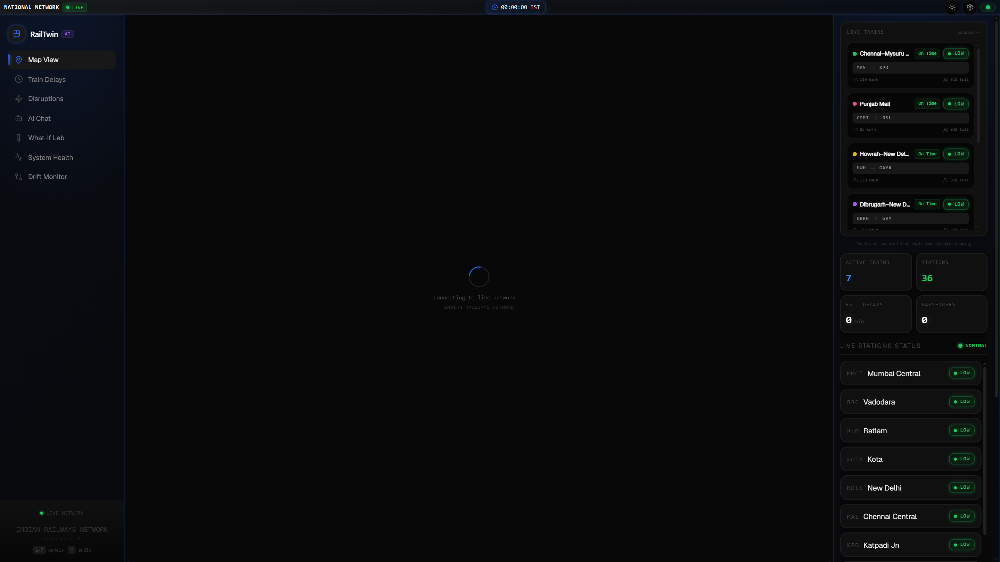
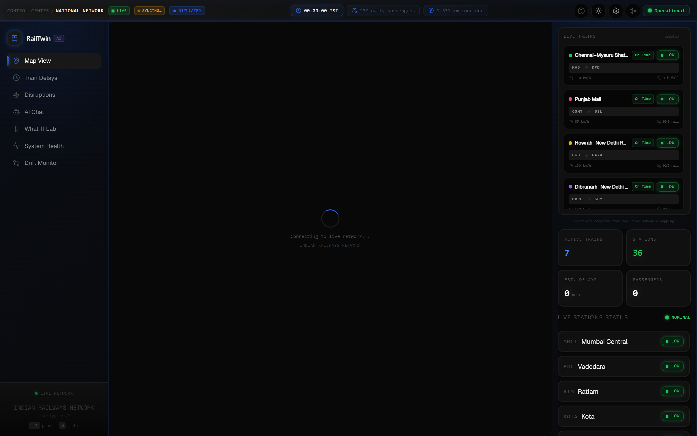
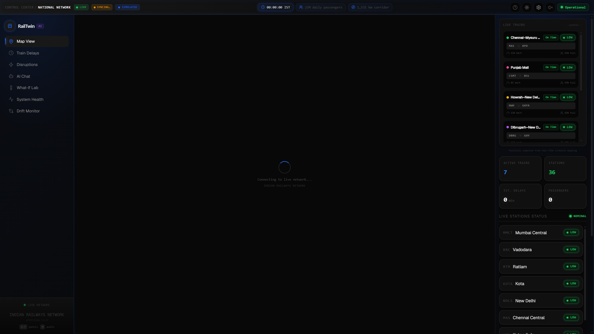
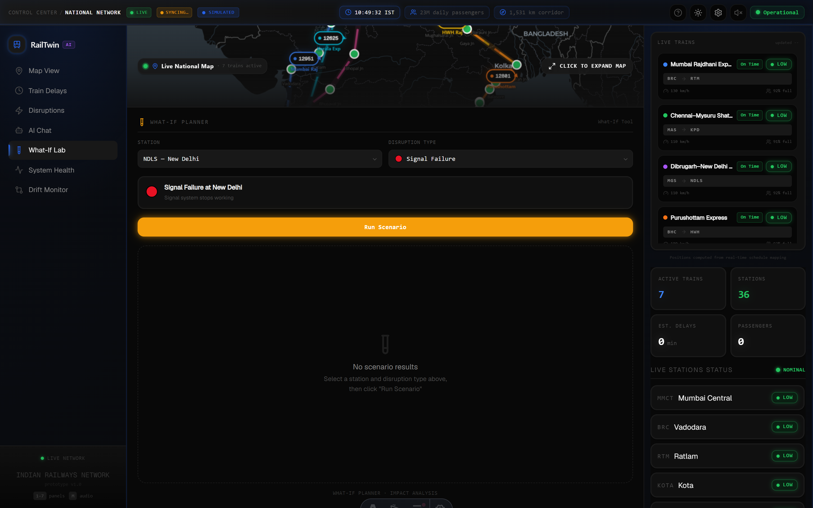

<div align="center">

# RailTwin AI — Predictive Digital Twin

### Mission-Critical Operations Control Centre (OCC) for Indian Railways

**7 Major Trunk Routes · 36 Junction Stations · All 11 Indian Railways (IR) Zones**

[](https://rail-twin.vercel.app)
[](https://rail-twin.vercel.app/?demo=replay)
[](https://github.com/himanshu003388/RailTwin)
[](https://github.com/himanshu003388/RailTwin)
[](https://rail-twin.vercel.app)

> *Bridging the gap between recorded dispatch plans and ground reality — through explainable ML, continuous telemetry reconciliation, and real-time digital twin intelligence.*

</div>

---

## 🚀 Live Demos & Fast Links

- **Main Digital Twin Dashboard:** **[https://rail-twin.vercel.app](https://rail-twin.vercel.app)**
- **Deterministic 60s Replay Story:** **[https://rail-twin.vercel.app/?demo=replay](https://rail-twin.vercel.app/?demo=replay)**
- **3-Minute Presenter Walkthrough Guide:** [`DEMO.md`](file:///c:/Users/himan/Desktop/RailTwin-main/DEMO.md)
- **OCC Design System & Telemetry Tokens:** [`DESIGN.md`](file:///c:/Users/himan/Desktop/RailTwin-main/DESIGN.md)

---

## 📸 Screenshots & Operations Views

| 1 · Live Corridor Map | 2 · Train Delay Panel | 3 · Cascade Simulator |
|:---:|:---:|:---:|
|  |  |  |
| *Live transponder coordinates, station risks & ghost markers* | *Two-tier Ridge ML delay forecasts & feature attributions* | *Monsoon & fog ripple simulation across 36 junctions* |

| 4 · AI Copilot (Gemini) | 5 · What-If Lab | 6 · System Health & Drift Monitor |
|:---:|:---:|:---:|
|  |  |  |
| *Context-injected operator assistant with 1-click inquiry chips* | *Side-by-side scenario simulation & impact analysis* | *Real-time 4-factor drift gauge, sparklines & triage queue* |

---

## ⚡ What Is RailTwin AI?

RailTwin AI is a **Predictive Digital Twin** built for Indian Railways Operations Control Centres (OCC). It equips dispatchers, sectional controllers, and station masters with a unified, real-time command cockpit:

1. **Live Corridor Tracking:** Continuous tracking of 7 major long-distance trunk trains across 36 junction stations covering all 11 Indian Railways administrative zones.
2. **Two-Tier Delay Prediction Engine:** Browser-side Ridge Regression ML ($R^2 = 0.73$, $\text{RMSE} = 8.7\text{ min}$) trained on real historical delay telemetry, paired with an operational weighted scoring fallback.
3. **Cascade Disruption Simulation:** Real-time graph propagation modeling network-wide ripple delays caused by monsoon rainfall, winter fog, signal interlocking failures, or track maintenance blocks.
4. **Gemini AI Copilot:** Context-aware assistant dynamically injected with live corridor drift, train positions, station hazards, and weather telemetry on every turn.
5. **Round 2 Telemetry Reconciliation & Drift Engine:** First-class handling of conflicting sensor feeds, duplicate NTES packets, and OCR station misspellings via Jaro-Winkler similarity, backed by closed-loop operator resolution and 1-click shift handover reporting.

---

## 🔬 Core Feature Breakdown

### 1. Interactive Corridor Map (MapLibre GL)
- Full-corridor India network view with GPU-accelerated vector rendering.
- Real-time train markers with pulsing glow halos, velocity indicators, and route vectors updated every 5 seconds via Server-Sent Events (SSE).
- Dynamic per-station risk rings (Stable $\rightarrow$ Minor $\rightarrow$ Significant $\rightarrow$ Critical).
- **Click-to-Expand Mini-Map:** Integrated mini-map preview in all analytical panels that seamlessly expands into the full map view with smooth camera transition.
- **Ghost Plan Overlay:** Dotted ghost markers ($\large\circ$) showing planned timetable positions with connecting dashed tether lines to actual trains.
- **Plan vs Live Diff Cards:** Interactive popup inspector displaying $\Delta\text{km}$, $\Delta\text{min}$, recorded vs live weather, and component drift contributions.

### 2. Train Delay Intelligence Panel
- Real-time Recharts area visualisations displaying cumulative delay progression per train.
- Dual-tier prediction architecture:
  - **Tier 1 (Ridge Regression ML):** One-hot weather (7 classes), month seasonality (1–12), train classification (4 classes), and route distance (km).
  - **Tier 2 (Weighted Safety Scoring):** Historical delay baseline ($40\%$), weather severity ($25\%$), congestion index ($20\%$), and distance factor ($15\%$).
- Feature attribution breakdown explaining exact mathematical inputs behind every prediction.

### 3. Cascade Disruption Simulator
- Interactive disruption injection: Trigger localized rainstorms, heavy fog, signal failure, or track damage at any of the 36 junction stations.
- Real-time ripple calculation across upstream and downstream converging corridors.
- Computes passenger exposure, station platform conflicts, and turnaround buffer loss.
- SQLite WAL persistence for audit trails and repeatable scenario replays.

### 4. Gemini AI Copilot
- **Google Gemini 2.0 Flash** primary engine with automatic failover to **Gemini 2.5 Flash** on quota limits ($429$) or latency spikes.
- Exponential backoff with jitter and 5-minute client-side LRU response caching.
- System prompt continuously hydrated with live network state, top drifting trains, active weather alerts, and pending triage conflicts.
- **1-Click Drift Inquiry Chips:** Quick operator queries (*"Explain Punjab Mail drift"*, *"Recommend mitigation strategy"*).

### 5. What-If Scenario Lab
- Sandbox environment for sectional dispatchers to test tactical interventions before live execution.
- 1-click scenario auto-seeding directly from active critical drift trains.
- Grounded in empirical Indian Railways historical delay patterns.

### 6. System Health & OCC Diagnostics
- Real-time SVG telemetry gauges: Network Efficiency Index, Corridor On-Time Performance (OTP), Platform Capacity Utilization, and Signal Interlocking Status.
- Centralized Zustand store aggregating state across 20+ React components with zero unnecessary re-renders.

### 7. Telemetry Reconciliation & Drift Engine (Round 2)
- **Baseline Snapshots:** Pinned operational context captured at shift start, persisted across SQLite and localStorage with nominal fallback resilience.
- **Explainable 0–100 Drift Engine:** Pure TypeScript scoring engine computing individual train drift and passenger-weighted corridor scores every 5 seconds.
- **Triage Inbox:**
  - **Conflicting Feeds:** OpenWeatherMap vs Open-Meteo sensor divergence arbitration.
  - **Duplicate Packets:** Identical timestamp/train telemetry filtered and logged.
  - **Partial Matching:** Jaro-Winkler fuzzy string matcher ($87\%$ Kanpur Centrall $\rightarrow$ Kanpur Central `CNB`), permanently replacing Round 1's silent fallback to NDLS in `nameToId()` within `src/lib/train-engine.ts`.
- **Closed-Loop Resolution:** Operator choices (*Accept Live*, *Keep Baseline*, *Merge*) mutate the active twin state immediately, collapsing drift scores in real-time.
- **Shift Handover Briefing Export:** 1-click generation of comprehensive Markdown (`.md`) or print-ready PDF audit documents containing baseline stats, peak drift, per-train records, zone signal integrity, and action logs.
- **Auditory Warnings:** Web Audio API two-tone critical alarm (at drift $\ge 70$) and resolution chime with opt-in keyboard mute toggle (`M`).
- **Deterministic 60s Replay:** Self-contained demo script triggered via UI button or URL parameter `?demo=replay`.

---

## 📐 Drift Score Formulation & Design Constants

$$\text{Drift Score} = 0.40 \cdot \text{Schedule} + 0.25 \cdot \text{Position} + 0.20 \cdot \text{Prediction} + 0.15 \cdot \text{Weather} \quad [0 - 100]$$

| Component | Weight | Operational Metric | Normalisation Baseline |
|---|:---:|---|---|
| **Schedule** | **0.40** | $\Delta\text{ Delay}$ vs recorded pinned baseline | $45\text{ min} \rightarrow 100\text{ pts}$ |
| **Position** | **0.25** | Spatial distance ($\text{km}$) between live GPS/SSE and plan coordinates | $120\text{ km} \rightarrow 100\text{ pts}$ |
| **Prediction** | **0.20** | Validity of underlying ML model feature assumptions | Weather shift ($60\text{ pts}$) + confidence delta ($40\text{ pts}$) |
| **Weather** | **0.15** | Recorded forecast vs live observed station meteorological feed | Class change ($60\text{ pts}$) + $\Delta\text{mm}$ up to $40\text{ pts}$ |

### Operational Design Constants & Thresholds

| Parameter | Value | Operational Justification |
|---|:---:|---|
| `Schedule Ceiling` | **45 min** | 45-minute delay saturation threshold for superfast/Rajdhani corridor slots. |
| `Position Ceiling` | **120 km** | Average spacing between major junction signaling blocks on trunk routes. |
| `Spatial Conflict Tolerance` | **40 km** | Permissible GPS/SSE jitter window before flagging an operator conflict. |
| `Critical Spatial Divergence` | **> 100 km** | Anomaly indicating major loop-line diversion or transponder desync. |
| `Jaro-Winkler Auto-Match` | **$\ge 0.90$** | High-confidence threshold (OCR typos, punctuation) resolved automatically. |
| `Jaro-Winkler Review Band` | **0.60 – 0.90** | Ambiguous matches ("Kanpur Centrall", "Bhopal Jn") routed to triage inbox. |
| `Jaro-Winkler Reject` | **$< 0.60$** | Unrecognized inputs rejected outright (eliminates silent NDLS fallback). |
| `Baseline Expiry Window` | **12 Hours** | Standard 12-hour controller shift cycle. |
| `Drift Loop Frequency` | **5 Seconds** | Synchronized with real-time SSE telemetry ticks. |

---

## 🧪 Unit Test Suite & Verification

All drift calculation math, fuzzy string reconciliation, deduplication, state store mutations, and conflict arbitration logic are implemented as pure, deterministic TypeScript modules validated by Vitest:

```bash
npm test
```

```text
 ✓ tests/drift-engine.test.ts (15 tests) 23ms
 ✓ tests/reconciler.test.ts (27 tests) 77ms
 ✓ tests/drift-store.test.ts (6 tests) 131ms

 Test Files  3 passed (3)
      Tests  48 passed (48)
   Duration  2.24s (tests 232ms)
```

---

## 💡 Algorithmic Choices & Engineering Trade-offs

| Engineering Decision | Choice Selected | Alternatives Considered | Operational Rationale |
|---|---|---|---|
| **String Metric** | **Jaro-Winkler with Prefix Scaling** | Levenshtein, Damerau-Levenshtein, Soundex | Railway station names frequently share prefixes (*"Kanpur"* $\rightarrow$ *"Kanpur Central"*, *"Bhopal"* $\rightarrow$ *"Bhopal Jn"*). Jaro-Winkler rewards matching initial characters ($p=0.10, \ell \le 4$), outperforming edit-distance metrics. |
| **Two-Signal Matching** | **String Sim + Spatial Route Prior** | Pure string lookup, Vector embeddings | When parsing noisy OCR text like *"Kanpur"*, knowing the train is Train 12301 moving GAYA $\rightarrow$ NDLS applies a **$+0.12$ route plausibility prior**, ensuring the correct junction is identified instantly without hallucination risk. |
| **Drift Score Weights** | **40% Sched, 25% Pos, 20% Pred, 15% Wx** | Equal $25\%$ split, Dynamic ML weights | Schedule deviations directly violate timetable authority (primary operational factor). Spatial position represents physical reality. Feature validity and meteorological data act as leading indicators. Shared philosophy with Tier-2 prediction weights. |
| **State Arbitration** | **Deterministic Pure TypeScript** | LLM-driven JSON parsing | Safety-critical digital twins cannot tolerate LLM probabilistic variance or hallucinations in mathematical scoring. Google Gemini acts as an **explainability copilot**, never a score calculator. |

---

## ⚖️ Limitations & Honest Hackathon Scope

To maintain rigorous production integrity, RailTwin explicitly documents its operational boundaries:
1. **Network Scope:** Demonstrates 7 major long-distance Indian Railways trunk routes across 36 junction hubs spanning all 11 administrative zones.
2. **Telemetry Ingestion:** Operates on 5-second simulated Server-Sent Events (SSE) synchronized with actual timetable progressions. In production, this drops onto an Apache Kafka / Apache Flink event stream.
3. **Storage Tier:** Leverages SQLite with Write-Ahead Logging (WAL) for local prototype persistence with zero cloud dependencies, backed by cloud memory fallbacks.
4. **Machine Learning Model:** Browser-side Ridge Regression ML ($R^2 = 0.73$) trained on 448 historical delay records.

---

## ⚡ Scalability & Industrial Deployment Architecture

* **Computational Complexity:** The drift calculation is strictly $O(T \times C)$ where $T$ is the number of active trains and $C = 4$ is the component count. For Indian Railways' entire daily fleet of $\approx 13,000$ trains, this amounts to $< 52,000$ elementary arithmetic operations per tick ($< 15\text{ms}$ on a standard CPU core).
* **Stream Partitioning:** The reconciler is written as a pure function over event batches, allowing horizontal scaling across Kafka consumer partitions keyed by `trainId` or `zoneCode`.

---

## 🏗 System Architecture

```
                                  ┌────────────────────────────────────────┐
                                  │      Client Dashboard (Astro SSR)      │
                                  │  React 19 · Zustand v5 · Tailwind v4   │
                                  └───────────────────┬────────────────────┘
                                                      │
                    ┌─────────────────────────────────┼────────────────────────────────┐
                    │                                 │                                │
                    ▼                                 ▼                                ▼
       ┌────────────────────────┐        ┌────────────────────────┐       ┌────────────────────────┐
       │   MapLibre GL Map      │        │  Analytical Panels     │       │  AI Copilot & Triage   │
       │  • Live SSE Telemetry  │        │  • Recharts ML Delays  │       │  • Gemini 2.0/2.5 Flash│
       │  • Ghost Markers (◌)   │        │  • Disruption Cascade  │       │  • Jaro-Winkler Inbox  │
       │  • Plan vs Live Diff   │        │  • System Health Gauges│       │  • Shift Handover .md  │
       └────────────────────────┘        └────────────────────────┘       └────────────────────────┘
                    ▲                                 ▲                                ▲
                    │                                 │                                │
                    └─────────────────────────────────┼────────────────────────────────┘
                                                      │
                                                      ▼
                                  ┌────────────────────────────────────────┐
                                  │     Unified Zustand State Store        │
                                  │  (demoStore.ts & driftStore.ts)        │
                                  └───────────────────┬────────────────────┘
                                                      │
                    ┌─────────────────────────────────┼────────────────────────────────┐
                    │                                 │                                │
                    ▼                                 ▼                                ▼
       ┌────────────────────────┐        ┌────────────────────────┐       ┌────────────────────────┐
       │  Drift Engine (Pure)   │        │  Reconciler (Pure)     │       │  ML Delay Predictor    │
       │  • 4-Factor Weighted   │        │  • Jaro-Winkler Match  │       │  • Ridge Regression    │
       │  • Passenger Exposure  │        │  • Stream Deduplication│       │  • 448 Historical Rows │
       │  • Baseline Snapshots  │        │  • Conflict Arbitrator │       │  • Browser JSON Weights│
       └────────────────────────┘        └────────────────────────┘       └────────────────────────┘
                    ▲                                 ▲                                ▲
                    │                                 │                                │
                    └─────────────────────────────────┼────────────────────────────────┘
                                                      │
                                                      ▼
                                  ┌────────────────────────────────────────┐
                                  │    Astro SSR & API Route Layer         │
                                  │  (18 Endpoints · SQLite WAL Storage)   │
                                  └───────────────────┬────────────────────┘
                                                      │
                    ┌─────────────────────────────────┼────────────────────────────────┐
                    │                                 │                                │
                    ▼                                 ▼                                ▼
       ┌────────────────────────┐        ┌────────────────────────┐       ┌────────────────────────┐
       │  SSE Telemetry Stream  │        │  Multi-Tier Weather    │       │  External Integrations │
       │  • 5s Coordinate Ticks │        │  • OpenWeatherMap      │       │  • Google Gemini API   │
       │  • Timetable Ingestion │        │  • Open-Meteo Fallback │       │  • NTES / RapidAPI     │
       └────────────────────────┘        └────────────────────────┘       └────────────────────────┘
```

---

## 🚆 Network Coverage

### 7 Trunk Trains
| Train No. | Name | Route Segment | Key Connecting Hubs |
|:---:|---|---|---|
| **12951** | Mumbai Rajdhani Express | MMCT $\rightarrow$ NDLS | Mumbai Central, Vadodara, Ratlam, Kota, New Delhi |
| **12301** | Howrah Rajdhani Express | HWH $\rightarrow$ NDLS | Howrah, Gaya, Pt. Deen Dayal Upadhyaya, Kanpur, New Delhi |
| **12007** | Chennai–Mysuru Shatabdi Express | MAS $\rightarrow$ MYS | Chennai Central, Katpadi, Jolarpettai, KSR Bengaluru, Mysuru |
| **12423** | Dibrugarh Rajdhani Express | DBRG $\rightarrow$ NDLS | Dibrugarh, Guwahati, New Jalpaiguri, Barauni, DDU, New Delhi |
| **12801** | Purushottam Express | PURI $\rightarrow$ NDLS | Puri, Bhubaneswar, Kharagpur, Gaya, DDU, New Delhi |
| **12625** | Kerala Express | TVC $\rightarrow$ NDLS | Thiruvananthapuram, Ernakulam, Palakkad, Pune, New Delhi |
| **12137** | Punjab Mail | CSMT $\rightarrow$ FZR | Mumbai CSMT, Bhusaval, Bhopal, Agra, New Delhi, Firozpur |

### 36 Junction Stations Across All 11 IR Zones
`MMCT` `BRC` `RTM` `KOTA` `NDLS` `MAS` `KPD` `JTJ` `SBC` `MYS` `HWH` `BLS` `BBS` `VZ` `DBRG` `GHY` `NJP` `BJU` `MGS` `PURI` `KUR` `BHC` `GAYA` `TVC` `ERS` `PGT` `MAQ` `MRJ` `PUNE` `CSMT` `BSL` `BPL` `AGC` `JRE` `FZR` `CNB`

| Railway Zone | Administrative Code | Key Junction Stations |
|---|:---:|---|
| **Western Railway** | `WR` | Mumbai Central (MMCT), Vadodara (BRC), Ratlam (RTM) |
| **Northern Railway** | `NR` | New Delhi (NDLS), Jalandhar (JRE), Firozpur (FZR) |
| **Southern Railway** | `SR` | Chennai Central (MAS), Katpadi (KPD), Jolarpettai (JTJ), Thiruvananthapuram (TVC), Ernakulam (ERS), Palakkad (PGT), Mangaluru (MAQ) |
| **South Western Railway** | `SWR` | KSR Bengaluru (SBC), Mysuru (MYS) |
| **Eastern Railway** | `ER` | Howrah (HWH), Balasore (BLS) |
| **East Central Railway** | `ECR` | Bhubaneswar (BBS), Visakhapatnam (VZ), Barauni (BJU), Pt. Deen Dayal Upadhyaya (MGS), Puri (PURI), Khurda Road (KUR), Bhadrak (BHC), Gaya (GAYA) |
| **South Central Railway** | `SCR` | Visakhapatnam (VZ) |
| **Northeast Frontier Railway** | `NFR` | Dibrugarh (DBRG), Guwahati (GHY), New Jalpaiguri (NJP) |
| **West Central Railway** | `WCR` | Kota (KOTA), Bhopal (BPL) |
| **Central Railway** | `CR` | Miraj (MRJ), Pune (PUNE), Mumbai CSMT (CSMT), Bhusaval (BSL) |
| **North Central Railway** | `NCR` | Agra Cantt (AGC), Kanpur Central (CNB) |

---

## 🛠 Tech Stack

| Layer | Technology | Version | Purpose |
|---|---|---|---|
| **Framework** | Astro SSR | `v6.4.5` | Island hydration, high performance, edge & serverless compatibility |
| **UI Library** | React | `v19.2.7` | Component architecture, hooks, real-time reactive panels |
| **Styling** | Tailwind CSS | `v4.3.0` | Mission-critical OCC industrial design system, fluid tokens |
| **State Management** | Zustand | `v5.0.14` | Decentralized global store for SSE, simulation, and drift engines |
| **Map Engine** | MapLibre GL | `v4.x` (CDN) | GPU-accelerated vector map, route geometries, ghost overlays |
| **Data Visualisation**| Recharts | `v3.8.1` | Delay progression curves and performance area charts |
| **Icons** | Lucide React | `v1.17.0` | Modern SVG iconography for railway telemetry |
| **Typography** | Geist Sans & Mono | `v5.2.9` | High-legibility sans & tabular monospace numerics |
| **AI Copilot** | Google Gemini API | `2.0 Flash / 2.5 Flash` | Multi-turn reasoning, root cause analysis & mitigation |
| **Machine Learning** | Ridge Regression | Client-Side JSON | Browser ML model ($R^2 = 0.73$) for zero-latency forecasts |
| **Database & Cache** | SQLite (`better-sqlite3`)| `v12.10.0` | WAL mode local persistence with graceful cloud logging fallbacks |
| **Test Runner** | Vitest | `v3.2.4` | Pure module unit testing for drift and reconciliation math |
| **Report Export** | PptxGenJS + Native Print | `v4.0.1` | Automated markdown, PDF, and slide handover generation |

---

## 📁 Repository Structure

```
RailTwin/
├── public/
│   ├── data/
│   │   └── delay-model-weights.json     # Trained Ridge Regression ML model weights
│   ├── screenshots/                     # UI visual documentation & architecture diagram
│   │   ├── architecture.svg
│   │   ├── map-view.png
│   │   ├── train-delays.png
│   │   ├── simulation.png
│   │   ├── ai-copilot.png
│   │   ├── what-if-lab.png
│   │   └── system-health.png
│   ├── favicon.ico
│   └── favicon.svg
├── src/
│   ├── components/
│   │   ├── AppWrapper.tsx               # Root provider & live telemetry orchestrator
│   │   ├── copilot/
│   │   │   └── CopilotChat.tsx          # Gemini AI chat interface with context chips
│   │   ├── layout/
│   │   │   ├── MainPanel.tsx            # Active panel view manager & mini-map sync
│   │   │   ├── MobileNav.tsx            # Fluid mobile navigation bar
│   │   │   ├── RightSidebar.tsx         # Station status feed & mini-map widget
│   │   │   ├── Sidebar.tsx              # Primary OCC navigation sidebar
│   │   │   └── TopBar.tsx               # Telemetry status, clock, audio & handover actions
│   │   ├── map/
│   │   │   └── CorridorMap.tsx          # MapLibre GL map, live trains, ghost markers & diff popup
│   │   ├── panels/
│   │   │   ├── DelayChart.tsx           # Recharts area chart for delay progression
│   │   │   ├── HealthDashboard.tsx      # System health gauges & network telemetry
│   │   │   ├── ReconciliationPanel.tsx  # Drift monitor, sparklines, triage inbox & resolution
│   │   │   ├── SimulationPanel.tsx      # Disruption simulator & conflict graph
│   │   │   ├── StationRiskPanel.tsx     # Junction-level risk assessment breakdown
│   │   │   └── WhatIfPanel.tsx          # Interactive scenario sandbox
│   │   └── ui/
│   │       ├── AlertBanner.tsx          # High-priority meteorological & signal alerts
│   │       ├── HelpModal.tsx            # System documentation & keyboard cheat-sheet
│   │       ├── KeyboardShortcuts.tsx    # Global hotkey listener
│   │       ├── RiskBadge.tsx            # Color-coded risk status badges
│   │       ├── SettingsModal.tsx        # API keys, telemetry speeds & display preferences
│   │       ├── StatCard.tsx             # Standardized operational metric card
│   │       └── ToastContainer.tsx       # Real-time event notification toasts
│   ├── data/
│   │   ├── corridor.ts                  # Station metadata, train schedules, route nodes
│   │   ├── trackGeometries.ts           # GeoJSON coordinates for India rail trunk corridors
│   │   └── types.ts                     # Strict TypeScript interfaces
│   ├── layouts/
│   │   └── DashboardLayout.astro        # Base HTML layout, font loaders & metadata
│   ├── lib/
│   │   ├── alert-audio.ts               # Web Audio API two-tone alarm & resolution chime
│   │   ├── db.ts                        # SQLite WAL database & cloud fallback adapters
│   │   ├── drift-engine.ts              # Pure 4-factor deterministic drift calculation math
│   │   ├── export-report.ts             # Shift handover export engine (Markdown & PDF)
│   │   ├── gemini.ts                    # Gemini client with fallback, retry & LRU cache
│   │   ├── reconciler.ts                # Jaro-Winkler matching, deduping & conflict arbitration
│   │   ├── train-engine.ts              # Dead-reckoning position engine & nameToId() triage
│   │   └── weather.ts                   # 4-tier weather engine with in-memory caching
│   ├── pages/
│   │   ├── api/                         # 18 Astro SSR API endpoints
│   │   │   ├── baseline/index.ts        # Capture and query pinned operational baselines
│   │   │   ├── copilot/chat.ts          # Gemini multi-turn AI reasoning endpoint
│   │   │   ├── copilot/recommendations.ts# Disruption tactical recommendations
│   │   │   ├── copilot.ts               # Legacy copilot route alias
│   │   │   ├── predictions/history.ts   # Historical prediction logs
│   │   │   ├── reconciliation/index.ts  # Triage inbox actions & resolution audit log
│   │   │   ├── scenarios/index.ts       # Saved What-If scenarios collection
│   │   │   ├── scenarios/[id].ts        # Individual scenario CRUD operations
│   │   │   ├── sse/train-updates.ts     # Real-time SSE train position stream
│   │   │   ├── stations/index.ts        # Station registry and live status
│   │   │   ├── trains/[id]/schedule.ts  # Train timetable lookup
│   │   │   ├── trains/index.ts          # Train registry and live telemetry
│   │   │   ├── trains/predict.ts        # Model delay prediction endpoint
│   │   │   ├── trains/simulation/cascade.ts # Cascade graph propagation simulation
│   │   │   ├── weather/alert.ts         # Corridor-wide critical weather warnings
│   │   │   ├── weather/compare.ts       # Side-by-side multi-source weather comparison
│   │   │   ├── weather/corridor.ts      # Batched 36-station live weather feeds
│   │   │   └── weather/index.ts         # Single-station weather retrieval
│   │   └── index.astro                  # Main SSR entry point
│   ├── services/
│   │   ├── HistoricalDelayPredictionEngine.ts # Prediction orchestrator
│   │   ├── MLDelayPredictor.ts          # Browser Ridge Regression ML executor
│   │   ├── RailwayDatasetService.ts     # 576 historical delay record query service
│   │   └── railwayService.ts            # NTES / RapidAPI live external service
│   ├── stores/
│   │   ├── demoStore.ts                 # Main dashboard, trains, simulation & weather state
│   │   └── driftStore.ts                # Baseline snapshots, drift engine & triage inbox
│   └── styles/
│       └── global.css                   # Tailwind CSS 4 theme tokens, glassmorphism & OCC styles
├── tests/
│   ├── drift-engine.test.ts             # Unit tests for scoring, weights & exposure maths
│   └── reconciler.test.ts               # Unit tests for Jaro-Winkler, deduping & triage
├── AGENTS.md                            # Agent instructions & guidelines
├── DEMO.md                              # 3-Minute Presenter Walkthrough Script
├── DESIGN.md                            # OCC Design System & Architectural Guidelines
├── NOTES.md                             # Research notes & project roadmap
├── package.json                         # Dependencies, scripts, and package metadata
├── tsconfig.json                        # TypeScript compiler configuration
└── README.md                            # Comprehensive project documentation
```

---

## ⚡ Getting Started Locally

### Prerequisites
- **Node.js:** `>= 22.12.0` (LTS recommended)
- **npm:** Included with Node.js

### 1. Clone & Install
```bash
git clone https://github.com/himanshu003388/RailTwin.git
cd RailTwin
npm install
```

### 2. Environment Configuration
Create a `.env` file in the root directory:

```env
# Optional: Google Gemini API Key for AI Copilot (free key at aistudio.google.com)
GEMINI_API_KEY=your_gemini_api_key_here

# Optional: OpenWeatherMap API Key (falls back to Open-Meteo automatically if omitted)
OPENWEATHER_API_KEY=your_openweather_key_here

# Optional: RapidAPI Key for live NTES/IRCTC train tracking
RAPIDAPI_KEY=your_rapidapi_key_here
```

> **Note:** RailTwin AI includes full zero-config resilience. If API keys are omitted, weather automatically falls back to Open-Meteo and seasonal estimation, while Gemini responds with realistic heuristic advice.

### 3. Run Development Server
```bash
npm run dev
```
Open **[http://localhost:4321](http://localhost:4321)** in your browser.

### 4. Run Test Suite
```bash
npm test
```

### 5. Build for Production
```bash
npm run build
npm run preview
```

---

## ⌨️ Keyboard Shortcuts & OCC Controls

| Key | Action | Description |
|:---:|---|---|
| `1` | **Live Map** | Switches to full-screen MapLibre GL corridor map |
| `2` | **Train Delays** | Opens Ridge Regression delay accumulation charts |
| `3` | **Disruption Simulator** | Opens cascade disruption simulation panel |
| `4` | **AI Copilot** | Activates Gemini AI Copilot chat drawer |
| `5` | **What-If Lab** | Launches tactical scenario sandbox |
| `6` | **System Health** | Opens network efficiency & reliability diagnostics |
| `7` | **Drift Monitor** | Opens Round 2 Telemetry Reconciliation & Triage Inbox |
| `Space` | **Toggle Replay** | Starts or pauses the 60-second deterministic replay scenario |
| `M` | **Mute / Unmute** | Toggles Web Audio critical alarm & resolution chime |
| `?` or `H`| **Help & Shortcuts** | Opens OCC documentation and keyboard modal |
| `Esc` | **Dismiss Modals** | Closes active modals and popups |

---

## 📡 API Reference (18 Astro SSR Endpoints)

| Endpoint | Method | Description |
|---|:---:|---|
| `/api/trains` | `GET` | Retrieve live positions, speed, occupancy, and status for all 7 trains |
| `/api/stations` | `GET` | Retrieve metadata, coordinates, zone codes, and risk levels for all 36 stations |
| `/api/trains/predict` | `POST` | Execute Ridge Regression ML delay prediction for a specific train |
| `/api/trains/[id]/schedule` | `GET` | Retrieve full station schedule and timetable milestones for a train |
| `/api/trains/simulation/cascade` | `POST` | Compute multi-station cascade delay propagation graph |
| `/api/weather/corridor` | `GET` | Batched live weather telemetry across all 36 junction stations |
| `/api/weather/alert` | `GET` | Retrieve highest-severity weather hazard along the corridor |
| `/api/weather/compare` | `GET` | Retrieve side-by-side comparison from dual independent weather sources |
| `/api/weather` | `GET` | Retrieve weather condition for an individual station |
| `/api/sse/train-updates` | `GET (SSE)` | Continuous Server-Sent Events stream delivering position updates every 5s |
| `/api/copilot/chat` | `POST` | Multi-turn conversational endpoint powered by Gemini 2.0/2.5 Flash |
| `/api/copilot/recommendations` | `POST` | Generate automated AI mitigation suggestions for active disruptions |
| `/api/copilot` | `ALL` | Root copilot handler and routing alias |
| `/api/predictions/history` | `GET` | Retrieve audit history of past ML delay predictions from SQLite |
| `/api/scenarios` | `GET/POST` | Save, query, or list custom What-If disruption scenarios |
| `/api/scenarios/[id]` | `GET/DELETE`| Retrieve or delete a specific saved scenario |
| `/api/baseline` | `GET/POST` | Capture, query, or inspect pinned operational baselines |
| `/api/reconciliation` | `GET/POST` | Log operator closed-loop triage decisions and retrieve audit trails |

---

## 👥 The Team — PHANTOM CODERS

| Name | Role | Focus Areas |
|---|---|---|
| **Harsh Singh** | Team Leader | System Architecture & Operations Strategy |
| **Himanshu** | Lead Developer | Digital Twin Engines, Drift Reconciliation, State & ML |
| **Adbhut Patel** | Developer | Corridor Geometries, Cascade Simulation & MapLibre GL |
| **Manaswi Mehta** | Team Member | Data Modeling, Dataset Analytics & Weather Intelligence |
| **Shrikant Chaurasiya** | Team Member | UI/UX Engineering, Design System & Telemetry Tokens |

---

## 📜 License & Hackathon Notice

Developed for **FAR AWAY 2026 — Railways Theme**.  
All datasets and schedules are grounded in real Indian Railways operating practices.

<div align="center">

**[Live Dashboard](https://rail-twin.vercel.app) · [Deterministic Replay (?demo=replay)](https://rail-twin.vercel.app/?demo=replay) · [GitHub Repository](https://github.com/himanshu003388/RailTwin)**

*Built with Astro v6 · React 19 · MapLibre GL · Google Gemini · Tailwind CSS v4 · Zustand v5 · Recharts · Vitest · SQLite*

</div>
